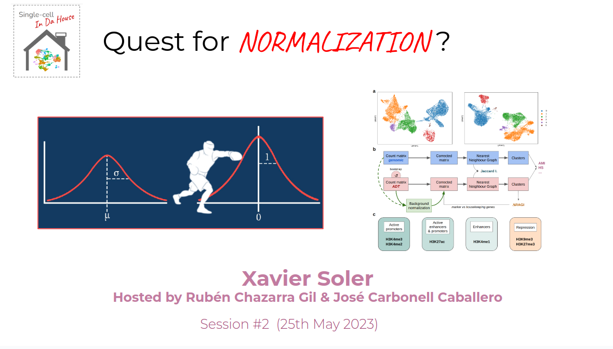

# ScidH-2023-05-Quest-for-Normalization

Single-cell in da House Session 2. Xavier Soler presenting on Single-cell CUT&amp;TagPRO data normalization strategies 

Second session of the Single-cell in da House initiative at  [Barcelona Supercomputing Center](bsc.es/) were **Xavier Soler Sanchis** presented his Master Thesis work focused in Single-cell CUT&TagPRO data normalization. 

We explored Single-cell CUT&TagPRO multi-omic protocol which profiles the transcriptome, proteome and epigenome of single-cells. Xavier Soler presented a previously undescribed bias between counts of data modalities and a built-in normalization strategy to fix it. 

These and more interesting questions are included in this session !

